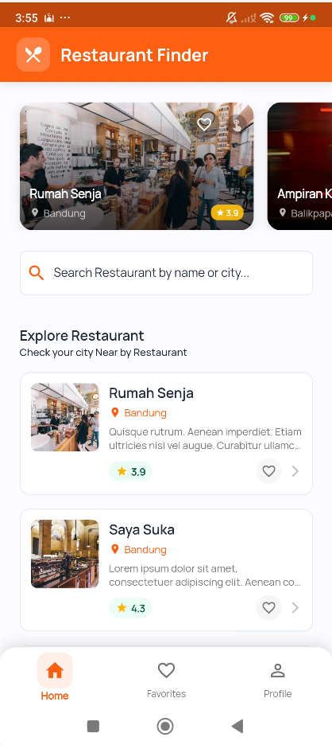
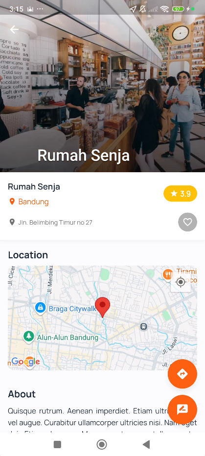

# 🍽️ Restaurant Finder

<div align="center">


_A modern Flutter application for discovering restaurants with intelligent search, Google Maps integration, and personalized features._

[Features](#-features) •
[Screenshots](#-screenshots) •
[Installation](#-installation) •
[Usage](#-usage) •
[Contributing](#-contributing)

</div>

---

## 📱 Overview

Restaurant Finder is a comprehensive Flutter application that helps users discover restaurants in their area with advanced search capabilities, detailed restaurant information, Google Maps integration for navigation, and personalized features like favorites and reviews.

## ✨ Features

### 🔍 **Smart Search & Discovery**

- **Intelligent Search**: Search restaurants by name or city with real-time filtering
- **Featured Restaurants**: Curated selection of highlighted restaurants
- **Popular Cities**: Quick access to restaurants in trending locations
- **City-based Sorting**: Prioritized display of local restaurants

### 🗺️ **Maps & Navigation**

- **Google Maps Integration**: Interactive maps showing restaurant locations
- **Turn-by-turn Navigation**: Direct integration with Google Maps for navigation
- **Location Services**: Automatic user location detection
- **Distance Calculation**: Real-time distance and time estimates

### 👤 **User Authentication**

- **Firebase Authentication**: Secure email/password login
- **Google Sign-In**: One-tap authentication with Google
- **User Profiles**: Personalized user experience
- **Secure Session Management**: Auto-login and session persistence

### ❤️ **Personalization**

- **Favorites System**: Save and manage favorite restaurants
- **Local Storage**: Offline access to saved favorites
- **User Reviews**: Submit and view restaurant reviews
- **Personalized Recommendations**: AI-driven restaurant suggestions

### 📱 **Modern UI/UX**

- **Material Design 3**: Modern, clean interface
- **Dark/Light Theme**: Adaptive theme support
- **Responsive Design**: Optimized for all screen sizes
- **Smooth Animations**: Engaging user interactions
- **Skeleton Loading**: Enhanced loading experience

### 🔧 **Technical Features**

- **Modular Architecture**: Clean, maintainable codebase
- **State Management**: Efficient state handling with BLoC/Provider
- **Offline Support**: Cached data for offline browsing
- **Error Handling**: Comprehensive error management
- **Performance Optimized**: Fast loading and smooth performance

## 🖼️ Screenshots

<div align="center">
<table>
<tr>
<td></td>
<td></td>
<td></td>
<td></td>
</tr>
<tr>
<td align="center"><b>Home Screen</b></td>
<td align="center"><b>Smart Search</b></td>
<td align="center"><b>Restaurant Detail</b></td>
<td align="center"><b>Maps & Navigation</b></td>
</tr>
</table>
</div>

## 🛠️ Installation

### Prerequisites

Before you begin, ensure you have the following installed:

- **Flutter SDK** (≥3.3.4)
- **Dart SDK** (≥3.3.4)
- **Android Studio** or **VS Code** with Flutter extensions
- **Git** for version control

### 📋 Setup Instructions

#### 1. **Clone the Repository**

```bash
git clone https://github.com/muhamadirwan99/restaurant-finder.git
cd restaurant-finder
```

#### 2. **Install Dependencies**

```bash
flutter pub get
```

#### 3. **Configure Environment Variables**

Create your environment file:

```bash
cp .env.example .env
```

Edit `.env` file and add your credentials:

```env
# Google Maps API Key
GOOGLE_MAPS_API_KEY=your_actual_api_key_here
```

#### 4. **Setup Google Maps API**

1. Go to [Google Cloud Console](https://console.cloud.google.com/google/maps-apis)
2. Create a new project or select an existing one
3. Enable the following APIs:
   - Maps SDK for Android
   - Maps SDK for iOS
   - Places API
   - Directions API
4. Create credentials (API Key)
5. Add the API key to your `.env` file

#### 5. **Configure Firebase**

1. Create a new Firebase project at [Firebase Console](https://console.firebase.google.com/)
2. Enable Authentication with Email/Password and Google Sign-In
3. Enable Firestore Database
4. Download `google-services.json` for Android and place it in `android/app/`
5. Download `GoogleService-Info.plist` for iOS and place it in `ios/Runner/`

#### 6. **Run the Application**

For development:

```bash
flutter run
```

For release build:

```bash
flutter build apk --release
```

## 📖 Usage

### **Getting Started**

1. **Launch the App**: Open Restaurant Finder on your device
2. **Sign In**: Create an account or sign in with Google
3. **Allow Location**: Grant location permissions for better recommendations
4. **Explore**: Browse featured restaurants or search for specific cuisines

### **Key Features Usage**

#### 🔍 **Searching Restaurants**

- Use the search bar to find restaurants by name or city
- Tap on popular city chips for quick filtering
- Browse featured restaurants in the carousel

#### 📍 **Restaurant Details**

- Tap any restaurant to view detailed information
- See ratings, reviews, and location on map
- Add to favorites with the heart icon
- Submit your own reviews

#### 🗺️ **Navigation**

- Tap the direction button to open navigation
- Get real-time directions via Google Maps
- View distance and estimated travel time

#### ❤️ **Managing Favorites**

- Add restaurants to favorites from detail page
- Access favorites from the bottom navigation
- Remove favorites by tapping the heart icon

## 🏗️ Architecture

### **Project Structure**

```
lib/
├── core/                   # Core utilities and configurations
├── routes/                 # App routing configuration
├── setup.dart             # App initialization
└── main.dart              # App entry point

packages/
├── base/                   # Base UI components and features
│   ├── beranda/           # Home screen
│   ├── detail/            # Restaurant detail
│   ├── favorit/           # Favorites management
│   ├── direction/         # Maps and navigation
│   ├── login/             # Authentication
│   ├── profile/           # User profile
│   ├── database/          # Local storage
│   ├── models/            # Data models
│   └── service/           # API services
└── core/                   # Core package with utilities
    ├── themes/            # App theming
    ├── utils/             # Helper utilities
    └── widgets/           # Reusable widgets
```

### **Key Technologies**

- **State Management**: BLoC Pattern with Cubit
- **Navigation**: GoRouter for declarative routing
- **Local Storage**: Hive for offline data persistence
- **Network**: Dio for HTTP requests
- **Maps**: Google Maps Flutter plugin
- **Authentication**: Firebase Auth
- **Analytics**: Firebase Analytics & Crashlytics

## 🤝 Contributing

We welcome contributions! Please see our [Contributing Guidelines](CONTRIBUTING.md) for details.

### **Development Setup**

1. Fork the repository
2. Create your feature branch (`git checkout -b feature/AmazingFeature`)
3. Commit your changes (`git commit -m 'Add some AmazingFeature'`)
4. Push to the branch (`git push origin feature/AmazingFeature`)
5. Open a Pull Request

### **Code Style**

- Follow [Effective Dart](https://dart.dev/guides/language/effective-dart) guidelines
- Use `flutter format` to format your code
- Run `flutter analyze` to check for issues
- Ensure all tests pass with `flutter test`

## 📝 License

This project is licensed under the MIT License - see the [LICENSE](LICENSE) file for details.

## 👨‍💻 Author

**Muhammad Irwan**

- GitHub: [@muhamadirwan99](https://github.com/muhamadirwan99)
- Email: [muhamadirwan1999@gmail.com](mailto:muhamadirwan1999@gmail.com)

## 🙏 Acknowledgments

- [Restaurant API](https://restaurant-api.dicoding.dev/) for providing restaurant data
- [Google Maps Platform](https://developers.google.com/maps) for maps integration
- [Firebase](https://firebase.google.com/) for backend services
- [Flutter Team](https://flutter.dev/) for the amazing framework

---

<div align="center">

**Made with ❤️ using Flutter**

If you found this project helpful, please give it a ⭐️!

</div>
